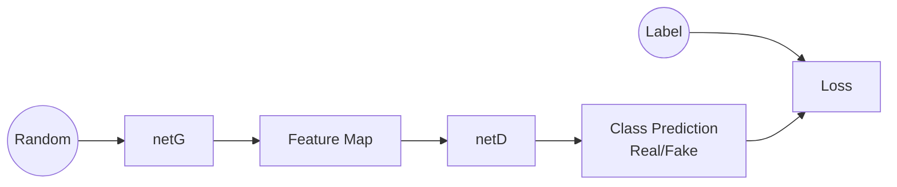

Pierre Moreau - Etienne Meunier - emeunier@bu.edu


# PyTorch Basics

## What is PyTorch 

### Create a Matrix

```python
x = torch.zeros(3,3,dtype=torch.long) # Create Zeros matrix
x = torch.tensor([1,2]) # create from tensor
x.Size # Return a tuple
```

### Operations

PyTorch Supercharges operators so we can directly use :

```python
result = x + y ## Addition
or
result = x.add(y)
```

An nice feature is ``inplace`` operations, we just have to add `_` after the name of the function : 

```python
x.add_(y) # Result stored in x 
```

Another nice thing is that **PyTorch supports numpy Indexing **

```python
print(x[1:10,:])
```

use ``x.view(NEW SIZE)`` to resize a vector and ``x.item()``  to get a python item. And ``x.numpy()`` to get a numpy array and ``x = torch.from_numpy()`` for the reverse !

## CUDA Tensors 

See later

## AutoGrad Module

### Grad Functions

Auto grad is a module of PyTorch that provide automatic differentiation.

This module allow to compute and store gradient for each of our tensor when we activate the function. 

Example : 

```python
x = torch.ones(2,2,requires_grad=True) # We have activated the gradients on this [2,2]
y = x + 2 # we set an operation and set y as the result 
print(y.grad_fn) # now y have a grad function associated 
```

```output
<AddBackward0 object at 0x7f434eaeddd8>
```

### Backpropagation

Now we have associated the gradients functions we can apply backpropagation to compute the gradients for our variables. 

Let's go with a super simple example

We want to compute : 
$$
\frac{d(8x+2)}{dx}=8
$$

```python
x = torch.ones(1,1,requires_grad=True) # Create scalar + activate gradients
y = 8x+2 # definde a grad function
y.backward() # compute the gradients
print(x.grad)
```

output : 

```
tensor([[8.]])
```

So we have the gradient stored in x, wonderfull.

Sometimes, when we train a model we need to activate the grad  but when we test it we don't want too ( for example to keep memory ), in order to avoid modifying all the expression we tcan use : 

```python
print(x.requires_grad) # it will print True
with torch.no_grad() :
	print(x.requires_grad) # it will print False
```

##  First Neural Network 

Now we can define a variable, do a computation and apply the backpropagation we can define our first neural network ( yeah, that was quick ). We will start by a simple Fully Connected neural network to predict housing price for the kaagle competition. 


```python
import torch.nn as nn
import torch.optim as optim
from loading_blocks import load_preprocess_datas, write_submission
import torch
import numpy as np


class FirstNeuralNet(nn.Module):

    def __init__(self, n_input):
        """
        In that function we define the different layers of the neural network
        n_input : number of dimension of the input data
        """
        super(FirstNeuralNet, self).__init__()  # call the super constructor from Pytorch nn.Module

        # Only 2 fully connected layers, we have one as final output because we want the price, so a scalar
        self.fc1 = nn.Linear(n_input, 10)
        nn.init.xavier_uniform_(self.fc1.weight)

        self.fc2 = nn.Linear(10, 5)
        nn.init.xavier_uniform_(self.fc2.weight)

        self.fc3 = nn.Linear(5, 1)
        nn.init.xavier_uniform_(self.fc3.weight)

    def forward(self, x):
        """
        We define the forward loop, so all the steps that will take the neural network
        x : input of the forward loop, so the features to predict, of shape [n_batch,n_input_shape]
        return : output of the feed forward, so y_hat
        """
        x = self.fc1(x).clamp(min=0)
        x = self.fc2(x).clamp(min=0) # Same as relu activation
        x = self.fc3(x)  # Execution of the Second layer + Linear activation because it's a regression
        return x


if __name__ == '__main__':
    X_train, X_test, y_train, y_test, X_submit, index_submit = load_preprocess_datas()

    net = FirstNeuralNet(X_train.shape[1])

    # Loss Function
    criterion = nn.MSELoss()

    # Optimizer
    optimizer = optim.Adam(net.parameters())

    n_iterations = 100000

    last_loss_test = 0

    # Typlical training loop:
    for i in range(n_iterations):
        output = net(X_train)
        loss = torch.sqrt(criterion(torch.log1p(output), torch.log1p(y_train)))

        if i % 1000 == 0:
            output_test = net(X_test)
            loss_test = torch.sqrt(criterion(torch.log1p(output_test), torch.log1p(y_test)))
            print('Iteration {} Loss Train : {} Loss Test {}'.format(i, loss, loss_test))
            if np.abs(last_loss_test - loss_test.item()) < 0.001 :
                break
            last_loss_test= loss_test.item()


        optimizer.zero_grad()  # zero the gradient buffers
        loss.backward()
        optimizer.step()  # Does the update

    y_submit = net(X_submit)
    write_submission(y_submit.data.numpy(), index_submit, file_name='submission.csv')

```

Here we can see we can define a dense network with a custom loss function and optimize it in a few lines of codes implementing also early stopping.

To print the list of parameters : 

```python
print(list(net.parameters()))
```


## LeNet 

In order to see Convolution layers + the loading of images data let's jump straight to LeNet on CIFAR-10

```python
import torch
import torch.nn as nn
import torch.nn.functional as F
import torchvision
import torch.optim as optim
import torchvision.transforms as transforms


def load_cifar_images():
    transform = transforms.Compose(
        [transforms.ToTensor(),
         transforms.Normalize((0.5, 0.5, 0.5), (0.5, 0.5, 0.5))])

    trainset = torchvision.datasets.CIFAR10(root='./data', train=True,
                                            download=True, transform=transform)
    trainloader = torch.utils.data.DataLoader(trainset, batch_size=4,
                                              shuffle=True, num_workers=2)

    testset = torchvision.datasets.CIFAR10(root='./data', train=False,
                                           download=True, transform=transform)
    testloader = torch.utils.data.DataLoader(testset, batch_size=4,
                                             shuffle=False, num_workers=2)

    classes = ('plane', 'car', 'bird', 'cat',
               'deer', 'dog', 'frog', 'horse', 'ship', 'truck')
    return trainloader, testloader, classes


class LeNet(nn.Module):

    def __init__(self):
        super(LeNet, self).__init__()
        # 1 input image channel, 6 output channels, 5x5 square convolution
        # kernel
        self.conv1 = nn.Conv2d(3, 6, 5)
        self.conv2 = nn.Conv2d(6, 16, 5)
        # an affine operation: y = Wx + b
        self.fc1 = nn.Linear(16 * 5 * 5, 120)
        self.fc2 = nn.Linear(120, 84)
        self.fc3 = nn.Linear(84, 10)

    def forward(self, x):
        # Expect input : (1,1,32,32) : Nsamples,nChannels,Height,Width
        # Max pooling over a (2, 2) window
        x = F.max_pool2d(F.relu(self.conv1(x)), (2, 2)) # CONV -> RELU -> MAXPOOL
        # If the size is a square you can only specify a single number
        x = F.max_pool2d(F.relu(self.conv2(x)), 2)
        x = x.view(-1, 16*5*5)  # FLATTEN
        x = F.relu(self.fc1(x))
        x = F.relu(self.fc2(x))
        x = self.fc3(x)
        return x

if __name__ == '__main__':

    trainloader, testloader, classes = load_cifar_images()

    net = LeNet()
    criterion = nn.CrossEntropyLoss() # Define MSE Loss Function
    optimizer = optim.SGD(net.parameters(), lr=0.001, momentum=0.9)

    for epoch in range(2):  # loop over the dataset multiple times

        running_loss = 0.0
        for i, data in enumerate(trainloader, 0):
            # get the inputs
            inputs, labels = data

            # zero the parameter gradients
            optimizer.zero_grad()

            # forward + backward + optimize
            outputs = net(inputs)
            loss = criterion(outputs, labels)
            loss.backward()
            optimizer.step()

            # print statistics
            running_loss += loss.item()
            if i % 2000 == 1999:  # print every 2000 mini-batches
                print('[%d, %5d] loss: %.3f' %
                      (epoch + 1, i + 1, running_loss / 2000))
                running_loss = 0.0

    print('Finished Training')

```

## Real Image Classification

Now we have a network we are going to get familiar with real life Image classification operations : 

### Data Augmentation 

PyTorch allow to do easily data augmentation, just need to add some steps in the `transforms.Compose()`

A cool features is we can at the same time divide the data into a train and val sets. 

```python
data_transforms = {
    'train': transforms.Compose([
        transforms.RandomResizedCrop(224),
        transforms.RandomHorizontalFlip(),
        transforms.ToTensor(),
        transforms.Normalize([0.485, 0.456, 0.406], [0.229, 0.224, 0.225])
    ]),
    'val': transforms.Compose([
        transforms.Resize(256), # Resize the image ( smaller size to 256)
        transforms.CenterCrop(224), # crop the image to (224,224)
        transforms.ToTensor(), # Turn the image to tensor
        transforms.Normalize([0.485, 0.456, 0.406], [0.229, 0.224, 0.225]) # Pixels [-1;1]
    ]),
}
```

### Load Data with Train/Val + GPU

Here we load the data using the train/val we defined + the GPU

```python
data_dir = 'data/hymenoptera_data'

# Extract Datasets
image_datasets = {x: datasets.ImageFolder(os.path.join(data_dir, x),
                                          data_transforms[x])
                  for x in ['train', 'val']}

# Create DataLoaders
dataloaders = {x: torch.utils.data.DataLoader(image_datasets[x], batch_size=4,
                                             shuffle=True, num_workers=4)
              for x in ['train', 'val']}

# Get sizes and list of classes
dataset_sizes = {x: len(image_datasets[x]) for x in ['train', 'val']}
class_names = image_datasets['train'].classes

# Set up GPU 
device = torch.device("cuda:0" if torch.cuda.is_available() else "cpu")
```

We can now access the train / val data using : 

```python
dataloaders['train']
dataloaders['val']
```

To use the gpu : 

```
inputs = inputs.to_device(device)
labels = labels.to_device(device)
```

Warning : if you choose to put your data on the gpu you have to put you model too, if you do not you will have an Runtime error like "model and imput have to have the same tipe torch.cuda.FloatTensor/torch.FloatTensor " this is because the to(device) change the type of the variable. 

Don't forget to also load the model to device to use the gpu :

```python
num_ftrs = model_ft.fc.in_features  # Get in features
model_ft.fc = nn.Linear(num_ftrs, 2) # Replace te fc of the model with an empty linear with 2 layers
```

### Save Best Model 

Because training a model can take a lot of time and sometimes the score can increase a bit over the time it is always nice to save the best model to have a record of the training, this way even if the server crash or the gradient explode we can still have a model.

```python
best_model_wts = copy.deepcopy(model.state_dict())
```

Here the model is saved into `best_model_wts`, we just have to call this function at the right time 

```python
model.load_state_dict(best_model_wts)
```

We can then load the best weights into the model.

### Schedule Learning Rate 

Scheduling Learning rate allow to improve a lot the convergence speed. 

```python
scheduler = optim.lr_scheduler() # set a new scheduler
for epoch in range(num_epochs) :  # at each epoch
	scheduler.step() # We step the scheduler before training
```

### Load a pretrained Model 

PyTorch give access to a lot of pretrained model that we can load an use :

```python
model_ft = models.resnet18(pretrained=True) # Load a resnet Model
```

We can then freeze the layers of the model to avoid ruining the weights with backpropagation :

```python
# We freeze all the layers of the original model
    for params in model_ft.parameters():
        params.requires_grad = False
```

Here the resnet18 model is pretrained on ImageNet and have 1000 possibles output :

```python
model_ft.fc
```

```
Linear(in_features=512, out_features=1000, bias=True)
```

We need to change that because we only need 2 outputs, nothing easier : 

```python
num_ftrs = model_ft.fc.in_features  # Get the number of in features
model_ft.fc = nn.Linear(num_ftrs, 2) # Replace last fc with an empty linear with 2 layers
```

#### Note on Training BatchNorm/Dropout 

Batch Normalization and Dropout need layers to act differently during training and test, for example with Dropout some of the neurones will be shut down during the training but of course not during the test. To manage that we need to change the "Mode" of the model using :

```python
model.train() # Set up training mode 
' Perform Training normally '

model.eval() # or model.train(False) to set up test mode
' Perform Testing normally '
```


## Implementation of Deep Convolutional GAN 

We know that the classical structure of GANS is like that :


### Define the inputs of the Model

#### 	Data

​		`dataroot` : path of the dataset folder

​		`Image size ` + `nc` : Image size and number of channel [ nc, w , h ] - [3,64,64]

#### 	Computational Load

​		`workers`: Number of threads to load the data -2

​		`batch size` : Number of image / batch - 128

​		`ngpu` : available number of gpus - 1

#### 	Model :

​		`nz` : Length of the latent vector  ( input of the generator) - 100

​		`ngf`: Depths of the feature map carried by the generator - 64

​		`ndf` : Depths feature map discriminator - 64

#### 	Training :

​		`num_epoch` : Number of epoch to do - 5 

​		`lr` : learning rate - 0.0002

​		`beta1` : parameters for Adam optimizer - 0.5

### Review the main functions 

To understand well the following code it is important to review the parameters of the main functions.

The first step is to load the image and transform them :

```python
data_transforms = transforms.Compose(list_transformations)
	- list transformation to apply on the data. Really usefull for data augmentation

dataset = ImageFolder(directory, transform ,loader) 
	- path to the directory. Warning each clas should have it's own subdir
    - Transform object
    - Loader : function to use to load the image 
 
DataLoader(dataset,batch_size,shuffle,num_workers,worker_init_fn) : 
	- dataset : Dataset object that loads the data
	- batch_size : int for the size of the batch we want
	- shuffle : True/False
    - num_workers : number of workers we use to extract
    - worker_init_fn : function called by each worker at starting
```


The next thing is to introduce a new and faster way to build a model, the Sequential Implementation : 

```python
model = Sequential(*args)
	- args : list of layers to applyt to build the odel
```

<u>Then the 2 star operations here :</u>

```python
Conv2D(in_channels, out_channels, kernel_size, stride=1, padding=0, bias=True)
	- in_channels : number of channels of the input
    - out_channels : number of channels of the output / Nunber of filters used
    - kernel_size : kernel used for deconvolution
    - stride : space to set between two output of deconvolution in the resultant matrix
    - padding : (n_input(stride-1)+kernel-stride)/2 to have same input and output size
```

```python
ConvTranspose2D(in_channels, out_channels, kernel_size, stride=1, padding=0,bias=True)
	- in_channels : number of channels of the input
    - out_channels : number of channels of the output / Nunber of filters used
    - kernel_size : kernel used for deconvolution
    - stride : space to set between two output of deconvolution in the resultant matrix
    - padding : ((n_input-1)*stride+f-n)/2 to have same input and output size
    - bias :
```

We saw in numerous example that normalization of the input can allow to fasten the process of a regression, for example here we always normalize the input image between -1 and 1. The idea behind batch norm is to apply a normalization step to the output of the layer **before the activation** to facilitate the research of W and b.

```python
BatchNorm2d(num_features)
	- num_features : number of channel of the image to normalize
```

<u>Activation Functions :</u>

```python
ReLU(inplace=False)
	- inplace : we directly modify the matrix that calls relu
LeakyReLU(negative_slope=0.01, inplace=False)
Tanh()
```

<u>Implementation Related Functions</u> :

**Detach :**

Detach allow to separate a tensor from the graph, this is useful to train the netD using data generated by netG without directly impacted netD during the optimization step : 

If we don't detach the feature Map generated before computing the prediction the graph will look like that 



so when we run the optimizer on the loss it is going to impact the netG because it's in the graph, we don't want that so we detach the Feature Map from the left graph using that function : 

```
tensor.detach() 
	Returns a new Tensor, detached from the current graph.
```

### Loading the Dataset 

Due to the form of the ImageFolder function of pytorch the images have to be in a sub directory of dataroot  with a descriptive name, they all have to be in the same sub directory.

```python
# We can use an image folder dataset the way we have it setup.
# Create the dataset
dataset = dset.ImageFolder(root=dataroot,
                           transform=transforms.Compose([
                               transforms.Resize(image_size), # All at the same size
                               transforms.CenterCrop(image_size), # Squarred images 
                               transforms.ToTensor(), # To tensor
                               transforms.Normalize((0.5, 0.5, 0.5), (0.5, 0.5, 0.5)),
                           ]))
# Create the dataloader - creates the batches
dataloader = torch.utils.data.DataLoader(dataset, batch_size=batch_size,
                                         shuffle=True, num_workers=workers)

# Decide which device we want to run on
device = torch.device("cuda:0" if (torch.cuda.is_available() and ngpu > 0) else "cpu")

```

### Initialize Weights 

Even if it is not set in every network the weight initialization can sometimes play a role and influence the result. 

The recommended value for DCGAN is to use a normal distribution centered in 0 and with stdev = 0.02

```python
# custom weights initialization called on netG and netD
def weights_init(m):
    classname = m.__class__.__name__
    if classname.find('Conv') != -1:
        nn.init.normal_(m.weight.data, 0.0, 0.02)
    elif classname.find('BatchNorm') != -1:
        nn.init.normal_(m.weight.data, 1.0, 0.02) # Error ?? 
        nn.init.constant_(m.bias.data, 0)
```

### Generator 

Let's attack the main part, the generator use a sequence of transpose-convolution layer to get an generated image from a vector of size `nz`.


```python
class Generator(nn.Module):
    def __init__(self, ngpu):
        super(Generator, self).__init__()
        self.ngpu = ngpu # number of gpu
        self.main = nn.Sequential(
            # input is Z, going into a convolution
            nn.ConvTranspose2d( nz, ngf * 8, 4, 1, 0, bias=False),
            nn.BatchNorm2d(ngf * 8),
            nn.ReLU(True),
            # state size. (ngf*8) x 4 x 4
            nn.ConvTranspose2d(ngf * 8, ngf * 4, 4, 2, 1, bias=False),
            nn.BatchNorm2d(ngf * 4),
            nn.ReLU(True),
            # state size. (ngf*4) x 8 x 8
            nn.ConvTranspose2d( ngf * 4, ngf * 2, 4, 2, 1, bias=False),
            nn.BatchNorm2d(ngf * 2),
            nn.ReLU(True),
            # state size. (ngf*2) x 16 x 16
            nn.ConvTranspose2d( ngf * 2, ngf, 4, 2, 1, bias=False),
            nn.BatchNorm2d(ngf),
            nn.ReLU(True),
            # state size. (ngf) x 32 x 32
            nn.ConvTranspose2d( ngf, nc, 4, 2, 1, bias=False),
            nn.Tanh()
            # state size. (nc) x 64 x 64
        )

    def forward(self, input):
        return self.main(input)
```

An interesting thing to observe is that the number of filer used is directly linked to the size of the feature map, the other part of the parameters are fix for any feature map size.

 ### Discriminator 

The discriminator is a binary classifier that take an image of size (nc,ngf,ngf) and gives a scalar output between 0 and 1.

```python
class Discriminator(nn.Module):
    def __init__(self, ngpu):
        super(Discriminator, self).__init__()
        self.ngpu = ngpu
        self.main = nn.Sequential(
            # input is (nc) x 64 x 64
            nn.Conv2d(nc, ndf, 4, 2, 1, bias=False),
            nn.LeakyReLU(0.2, inplace=True),
            # state size. (ndf) x 32 x 32
            nn.Conv2d(ndf, ndf * 2, 4, 2, 1, bias=False),
            nn.BatchNorm2d(ndf * 2),
            nn.LeakyReLU(0.2, inplace=True),
            # state size. (ndf*2) x 16 x 16
            nn.Conv2d(ndf * 2, ndf * 4, 4, 2, 1, bias=False),
            nn.BatchNorm2d(ndf * 4),
            nn.LeakyReLU(0.2, inplace=True),
            # state size. (ndf*4) x 8 x 8
            nn.Conv2d(ndf * 4, ndf * 8, 4, 2, 1, bias=False),
            nn.BatchNorm2d(ndf * 8),
            nn.LeakyReLU(0.2, inplace=True),
            # state size. (ndf*8) x 4 x 4
            nn.Conv2d(ndf * 8, 1, 4, 1, 0, bias=False),
            nn.Sigmoid()
        )

    def forward(self, input):
        return self.main(input)
```

### Loss Function

DCGAN use a Binary Cross Entropy loss function, usefull because the output of the Discriminator is a scalar 
$$
l_n=−[y_n⋅log(x_n)+(1−y_n)⋅log(1−x_n)]
$$
   Faire l'explication

```python
criterion = nn.BCELoss()

# We create a fixed subset of random for the latent variable, this way we can evauate our progress.
fixed_noise = torch.randn(64, nz, 1, 1, device=device)

# Establish convention for real and fake labels during training
real_label = 1
fake_label = 0

```

### Optimisation Method

It is recommended to use one separate optimizer for each network. 

```python
# Setup Adam optimizers for both G and D
optimizerD = optim.Adam(netD.parameters(), lr=lr, betas=(beta1, 0.999))
optimizerG = optim.Adam(netG.parameters(), lr=lr, betas=(beta1, 0.999))
```

### Training phase 

> Be mindful that training GANs is somewhat of an art form, as incorrect hyperparameter settings lead to mode collapse with little explanation of what went wrong.

https://github.com/soumith/ganhacks

#### Train the discriminator 

- Construct a Batch of sample from the training set 
- Forward pass the Discriminator and Calculate the loss function $log(D(x))$)
- Calculate the gradient with backward 
- Construct a Batch of Fake example with generator
- Forward pass the fake example and Calculate the loss function $log(1-D(G(z)))$
- Calculate the gradients and **accumulate** them with the first one.
- We can now use the disciminator

As we can see we divide the backward of the loss in 2 phases 

```python
############################
# (1) Update D network: maximize log(D(x)) + log(1 - D(G(z)))
###########################

## Reset the grad for the Discriminator Network
netD.zero_grad()

# Format batch
real_cpu = data[0].to(device) # Load the batch to gpu


# Create the vector of the input size with only True = [real_label]*b_size
b_size = real_cpu.size(0)
label = torch.full((b_size,), real_label, device=device)

# Forward pass real batch through D -> Get predictions
output = netD(real_cpu).view(-1)
# Calculate loss on all-real batch
errD_real = criterion(output, label)

# Calculate gradients for D in backward pass, WAIT to optimize !!!
errD_real.backward()
D_x = output.mean().item() # Accuracy of the classifier for True examples 

## Train with all-fake batch


# Generate batch of latent vectors using noise, same number of noise than real examples
noise = torch.randn(b_size, nz, 1, 1, device=device)
# Generate fake image batch with G
fake = netG(noise)
label.fill_(fake_label) # Convert the previously label vector to all False this time 
# Classify all fake batch with D, have to detach so the optimization don't impact netG !
output = netD(fake.detach()).view(-1) 
# Calculate D's loss on the all-fake batch
errD_fake = criterion(output, label)
# Calculate the gradients for this batch
errD_fake.backward()
D_G_z1 = output.mean().item() # 1-Accuracy of the classifier for generated Examples
# Add the gradients from the all-real and all-fake batches
errD = errD_real + errD_fake
# We can now optimize netD
optimizerD.step()
```

We can see that we separated the computation of the loss and gradients for the Real Examples and the generated examples and finally did the optimization on both gradients and not by summing the loop 

<u>What we expect to do :</u>

> loss = loss_real + loss_fake 
>
> loss.backward()
>
> optimizerD.step()

<u>What we really do :</u>

>loss_real.backward()
>
>loss_fake.backward()
>
>optimizerD.step()


#### Train the Generator

We will secondly train the generator, the steps are easier :

- Give again the Fakes to netD to make a prediction ( mow we updated it )
- Compute error, calculate gradients and optimize 

```python
############################
# (2) Update G network: maximize log(D(G(z)))
###########################
netG.zero_grad()
label.fill_(real_label)  # Here we use fake images

output = netD(fake).view(-1) # We use the same fake because generator didn't changed yet
# Calculate G's loss based on this output
errG = criterion(output, label)
# Calculate gradients for G , We only update 
errG.backward() # loos for G
D_G_z2 = output.mean().item() # G sucess faking 
# Update G
optimizerG.step()
```

Because we can't detach the participation of netD in the error it will have gradients in netD, because we optimizer_G act before netD, we don't call the optimizer_D and zero out the gradients after it has no incidence on netD. 

## Loss Function 

The choice of loss function is crucial for a Deep Learning application, in addition to allow the user to define his loss function PyTorch offers a lot a functions.

### NNLLLoss

[Understanding softmax and the negative log-likelihood](<https://ljvmiranda921.github.io/notebook/2017/08/13/softmax-and-the-negative-log-likelihood/>)

Negative Log Likelihood Loss, classification problems with $C$ classes 

```python
torch.nn.NLLLoss(weight=None, reduce=None, reduction='mean')
```

- **weight** : 1D tensor with the weight assigned to each class, useful for imbalanced training
- **reduce** : if False, don't average loss for a mini batch and return n rows

$$ l(x,y) = L = {l_1,...,l_N}, l_n= -{Weights}_{y_n}*x_{n,y_n}$$

<u>Input of this Loss :</u>

size : $(minibatch,C)$ C is the number of classes, we have the input for each class

We need to add a Log-Softmax layer before applying this cost function.

<u>Target of this Loss :</u>

Tensor 1D with the correct labels for each element of the mini batch.

<u>Output of this Loss :</u> 

Scalar with the loss for the mini batch, Loss for each element if reduce at False

### Cross Entropy Loss

Combine Log(Softmax(x)) with NNLLLoss, allows to avoid adding a Log-Softmax. This way we don't  have to use Softmax on the last layer of our network, we can just finish with a Dense Layer. 

 

*Sources :* 

[1] https://pytorch.org/tutorials/index.html

[2] https://pytorch.org/tutorials/beginner/blitz/cifar10_tutorial.html


# Inspired by FastAI Library

In this second part we will get interessted in more advanced techniques that help us to train models, the goal if to have a toolbox to find easily Hyperparameters or improve models. A lot of those techniques will be inspired by the Fast AI library which is relllying on Pytorch a lot. 

## Fast Ai's Learner

This is the Learner class use in Fast Ai library :

```python
Learner(data:DataBunch, model:Module, opt_func:Callable='Adam', loss_func:Callable=None, metrics:Collection[Callable]=None, true_wd:bool=True, bn_wd:bool=True, wd:Floats=0.01, train_bn:bool=True, path:str=None, model_dir:PathOrStr='models', callback_fns:Collection[Callable]=None, callbacks:Collection[Callback]=<factory>, layer_groups:ModuleList=None, add_time:bool=True, silent:bool=None)
```

As we can see we can input everything including a model which is.a Pytorch nn.Module 

## Optimisation

### Learning Rate Finder

The search for the right learning rate is always a complicated task, there is a technique called "Cyclical Learning Rate" that can allow us to find it in a semi-automated way. 

**<u>Fast AI :</u>**

```python
model.lr_find()
model.recorder.plot()
```

This function show the loss compared to the learning rate choice so we can choose manually the best learning rate. 

**<u>Pytorch</u>**

Counldn't find a official implementation yet but this https://github.com/davidtvs/pytorch-lr-finder give a nice implementation 

```plot
model = ...
criterion = nn.CrossEntropyLoss()
optimizer = optim.Adam(net.parameters(), lr=1e-7, weight_decay=1e-2)
lr_finder = LRFinder(net, optimizer, criterion, device="cuda")
lr_finder.range_test(trainloader, end_lr=100, num_iter=100)
lr_finder.plot()
```

Given the plot we have to pick the learning Rate by ourself, Lesli, the author of the paper on cyclical Learning rate advice to take a power of ten under the learning rate that offer the lowest loss on the graph. According to Jeremy "On the learning rate finder, what you are looking for is the strongest downward slope that's kind of sticking around for quite a while." 

### Cyclical Learning Rate Scheduler 

As describe in the paper [**Cyclical Learning Rates for Training Neural Networks**](https://arxiv.org/pdf/1506.01186.pdf) the fact to increase and then decrease the learning rate during each epoch can allow to have better results and a faster convergence by avoiding to get trapped in saddle points and take big steps when we can. 

**<u>Fast AI</u>**

In FastAI library it is really in the center of the training with 

```python
fit_one_cycle(learn:Learner, cyc_len:int, max_lr:Union[float, Collection[float], slice]=slice(None, 0.003, None), moms:Point=(0.95, 0.85), div_factor:float=25.0, pct_start:float=0.3, final_div:float=None, wd:float=None, callbacks:Optional[Collection[Callback]]=None, tot_epochs:int=None, start_epoch:int=None)
```

```python
model.fit_one_cycle(epochs)
```

that fits the model for a number of cycles, a cycles cover all the data as a classic epoch but the learning rate will change at each epoch. 

**<u>Pytorch</u>**

Pytorch also integrate this functionnality with :

```python
torch.optim.lr_scheduler.CyclicLR(optimizer, base_lr, max_lr, step_size_up=2000, step_size_down=None, mode='triangular', gamma=1.0, scale_fn=None, scale_mode='cycle', cycle_momentum=True, base_momentum=0.8, max_momentum=0.9, last_epoch=-1)
```

In the Pytorch version it is used as a scheduler that will be called after wich time we train the network, very easy.

```python
optimizer = torch.optim.SGD(model.parameters(), lr=0.1, momentum=0.9)
scheduler = torch.optim.lr_scheduler.CyclicLR(optimizer)
data_loader = torch.utils.data.DataLoader(...)
for epoch in range(10):
    for batch in data_loader:
        train_batch(...)
        scheduler.step()
```

### Different Learning Rate to Fine Tune model

Because we obvously dont want to train all the layers with the same learning rate, the general advice from fastai is to train the first layer with a learning rate 100 times smaller than the last layer and to equally repart for the layers between. If we use the learning rate finder, the learning rate picked with the technique will be the left bound ( the smaller one ).

Don't forget to first train the new layers ( stage 1 ) before doing the fine tuning ( stage 2), most of the time we can divide the lr of stage 1 by 10 to have the one of stage 2.

<u>**Fast Ai**</u>

```python
model.fit_one_cycle(2, max_lr=slice(1e-6,1e-4))
```

**<u>Pytorch</u>**

```python
optimizer = torch.optim.SGD([
  {'params':,'lr':}
 	{'params':,'lr':}
])
```


